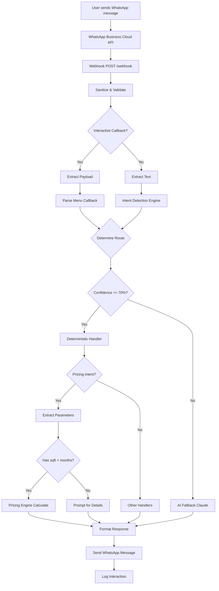

# System Architecture

Production-grade WhatsApp Bot for ezstorage.sg

## 🎯 Design Principles

1. **Deterministic Pricing** - Zero AI involvement in calculations
2. **Confidence-Based Routing** - Clear threshold for deterministic vs AI handling
3. **Separation of Concerns** - Each module has a single responsibility
4. **Fail-Safe Design** - Graceful degradation when services fail
5. **Scalability** - Stateless, horizontally scalable architecture

## 📊 System Flow



## 🧩 Component Architecture

### Core Engines

#### 1. Intent Detection Engine
**Purpose**: Determine what the user wants (deterministic, keyword-based)

**Input**: Raw message text

**Process**:
1. Normalize text to lowercase
2. Split into words
3. Match against keyword dictionary
4. Calculate weighted confidence score
5. Identify primary and secondary intents

**Output**: 
```javascript
{
  intent: 'pricing',
  confidence: 85,
  secondaryIntents: [
    { intent: 'unit_sizes', confidence: 35 }
  ]
}
```

**Confidence Calculation**:
```javascript
score = 0
for each keyword match:
  score += keyword.weight

// Bonus for numerical indicators
if (hasSqft || hasMonths):
  score += 25

confidence = min(score, 100)
```

#### 2. Pricing Engine
**Purpose**: Calculate storage quotes (100% deterministic)

**Input**:
```javascript
{
  sqft: 50,
  months: 6,
  promoCode: 'FIRST10'
}
```

**Process**:
1. Validate inputs
2. Lookup base rate from tier table
3. Calculate duration discount
4. Apply promo code (with stacking logic)
5. Calculate GST (9%)
6. Generate itemized breakdown

**Output**:
```javascript
{
  sqft: 50,
  months: 6,
  baseRate: 450.00,
  durationDiscountPercent: 0.05,
  durationDiscount: 22.50,
  promoCode: 'FIRST10',
  promoDiscountPercent: 0.10,
  promoDiscount: 42.75,
  subtotal: 384.75,
  gst: 34.63,
  total: 419.38,
  totalForDuration: 2516.28
}
```

**Promo Code Stacking**:
- **Stackable promos**: Apply to subtotal after duration discount
- **Non-stackable promos**: Replace duration discount, apply to base rate

#### 3. Routing Engine
**Purpose**: Route messages to appropriate handlers

**Decision Tree**:
```
if intent == 'greeting' or 'menu':
  → Always deterministic (show menu)
  
if intent == 'human':
  → Always deterministic (escalate)
  
if confidence >= threshold:
  → Deterministic handler for that intent
  
else:
  → AI fallback (Claude)
```

### Service Layer

#### WhatsApp Service
- Integrates with WhatsApp Business Cloud API
- Handles text messages, interactive buttons, lists
- Manages message status (read receipts, reactions)
- Retry logic for failed sends

#### Claude Service
- Integrates with Anthropic Claude API
- System prompt enforces business rules
- Falls back gracefully on API errors
- Supports conversation history (for future)

#### Menu Service
- Builds interactive button menus
- Builds interactive list menus
- Provides follow-up prompts
- Parses callback payloads

### Middleware Layer

#### Validator
- Verifies webhook signature (optional)
- Validates message structure
- Checks required fields
- Prevents unauthorized access

#### Error Handler
- Catches all unhandled errors
- Logs with context
- Returns user-friendly messages
- Prevents stack trace leakage

### Utility Layer

#### Logger (Winston)
- Console output (development)
- File output (production)
- Log levels: error, warn, info, debug
- Request/response logging

#### Sanitizer
- Removes dangerous characters
- Limits input length
- Validates phone numbers
- Prevents injection attacks

#### Formatter
- WhatsApp markdown formatting
- Emoji support
- Consistent message templates
- Response builders

## 🔄 Message Processing Flow

### 1. Incoming Message
```
WhatsApp → Webhook → Validation → Sanitization
```

### 2. Intent Detection
```
Message Text → Keyword Matching → Confidence Scoring → Intent + Score
```

### 3. Routing Decision
```
Intent + Confidence → Route Determination → Handler Selection
```

### 4. Handler Execution
```
Handler → Data Processing → Response Generation → WhatsApp API → User
```

### 5. Logging
```
Every step logs to Winston → Console/Files → Monitoring
```

## 📊 Database Schema (Future)

For production scalability, migrate from in-memory config to database:

### Pricing Tables
```sql
-- Base pricing tiers
CREATE TABLE pricing_tiers (
  id SERIAL PRIMARY KEY,
  min_sqft INT NOT NULL,
  max_sqft INT NOT NULL,
  rate_per_sqft DECIMAL(10,2) NOT NULL,
  effective_date TIMESTAMP DEFAULT NOW(),
  is_active BOOLEAN DEFAULT TRUE
);

-- Duration discounts
CREATE TABLE duration_discounts (
  id SERIAL PRIMARY KEY,
  min_months INT NOT NULL,
  max_months INT,
  discount_percent DECIMAL(5,4) NOT NULL,
  is_active BOOLEAN DEFAULT TRUE
);

-- Promo codes
CREATE TABLE promo_codes (
  code VARCHAR(50) PRIMARY KEY,
  discount_type VARCHAR(20) NOT NULL,
  discount_value DECIMAL(10,2) NOT NULL,
  stackable BOOLEAN DEFAULT TRUE,
  valid_from TIMESTAMP,
  valid_until TIMESTAMP,
  usage_limit INT,
  times_used INT DEFAULT 0,
  is_active BOOLEAN DEFAULT TRUE
);
```

### Conversation Tables
```sql
-- Store all conversations
CREATE TABLE conversations (
  id UUID PRIMARY KEY DEFAULT uuid_generate_v4(),
  phone_number VARCHAR(20) NOT NULL,
  user_message TEXT NOT NULL,
  bot_response TEXT NOT NULL,
  intent VARCHAR(50),
  confidence INT,
  ai_fallback_used BOOLEAN DEFAULT FALSE,
  processing_time_ms INT,
  created_at TIMESTAMP DEFAULT NOW()
);

-- Index for analytics
CREATE INDEX idx_conversations_phone ON conversations(phone_number);
CREATE INDEX idx_conversations_intent ON conversations(intent);
CREATE INDEX idx_conversations_created ON conversations(created_at);
```

### Escalation Tables
```sql
-- Track human escalations
CREATE TABLE escalations (
  id UUID PRIMARY KEY DEFAULT uuid_generate_v4(),
  conversation_id UUID REFERENCES conversations(id),
  phone_number VARCHAR(20) NOT NULL,
  reason TEXT,
  status VARCHAR(20) DEFAULT 'pending',
  assigned_to VARCHAR(100),
  resolved_at TIMESTAMP,
  created_at TIMESTAMP DEFAULT NOW()
);

-- Index for support dashboard
CREATE INDEX idx_escalations_status ON escalations(status);
CREATE INDEX idx_escalations_assigned ON escalations(assigned_to);
```

## 🚀 Scaling Strategy

### Phase 1: Current (In-Memory)
- All config in code
- Single server instance
- Suitable for < 1000 messages/day

### Phase 2: Database + Cache
- Move pricing to PostgreSQL/Supabase
- Add Redis for:
  - Pricing quote caching (30 min TTL)
  - Frequent AI response caching (24h TTL)
  - Rate limiting
- Suitable for < 10,000 messages/day

**Redis Cache Keys**:
```javascript
// Pricing quotes
`quote:${sqft}:${months}:${promoCode}` → quote object (TTL: 1800s)

// AI responses for FAQs
`ai:${messageHash}` → response text (TTL: 86400s)

// Rate limiting
`ratelimit:${phoneNumber}` → count (TTL: 60s)
```

### Phase 3: Horizontal Scaling
- Multiple Node.js instances
- Load balancer (Nginx, AWS ALB)
- Shared Redis for state
- Database connection pooling
- Suitable for 10,000+ messages/day

**Load Balancer Config**:
```nginx
upstream whatsapp_bot {
  least_conn;
  server 10.0.1.10:3000;
  server 10.0.1.11:3000;
  server 10.0.1.12:3000;
}

server {
  listen 443 ssl;
  server_name bot.ezstorage.sg;
  
  location /webhook {
    proxy_pass http://whatsapp_bot;
  }
}
```

### Phase 4: Advanced Features
- Message queue (Bull/BullMQ) for async processing
- Separate worker processes
- Analytics dashboards
- A/B testing framework
- ML-based intent improvement
- Multi-language support

## 🔒 Security Architecture

### Defense Layers

1. **Network Level**
   - HTTPS only
   - Rate limiting per IP
   - Webhook signature verification

2. **Application Level**
   - Input sanitization
   - SQL injection prevention (when DB added)
   - XSS prevention
   - CSRF tokens (if web dashboard added)

3. **Data Level**
   - Environment variable encryption
   - API key rotation
   - Secure credential storage

4. **Monitoring Level**
   - Error alerting
   - Anomaly detection
   - API usage monitoring

## 📊 Monitoring & Observability

### Metrics to Track

**Business Metrics**:
- Messages received per hour
- Intent distribution
- AI fallback usage rate
- Human escalation rate
- Average response time
- User satisfaction (via feedback)

**Technical Metrics**:
- API success/failure rates
- Average processing time
- Error rates by type
- Cache hit rate
- Database query times

**Cost Metrics**:
- WhatsApp API costs
- Claude API token usage
- Infrastructure costs

### Logging Strategy

**Log Levels**:
- `error`: API failures, exceptions
- `warn`: High confidence not met, invalid inputs
- `info`: Message processing, routing decisions
- `debug`: Detailed intent scores, parameter extraction

**Log Aggregation** (Production):
- Use services like Datadog, New Relic, or ELK stack
- Set up alerts for error spikes
- Dashboard for real-time monitoring

## 🔄 Future Enhancements

### Short Term
1. Add webhook signature verification
2. Store conversation history
3. Track analytics
4. Build admin dashboard

### Medium Term
1. Migrate to database
2. Add Redis caching
3. Support attachments (images, PDFs)
4. Multi-language support
5. Voice message support

### Long Term
1. ML-based intent improvement
2. Context-aware conversations
3. Booking system integration
4. Payment integration
5. CRM integration

---

**This architecture is designed for production use and seamless scaling.**
